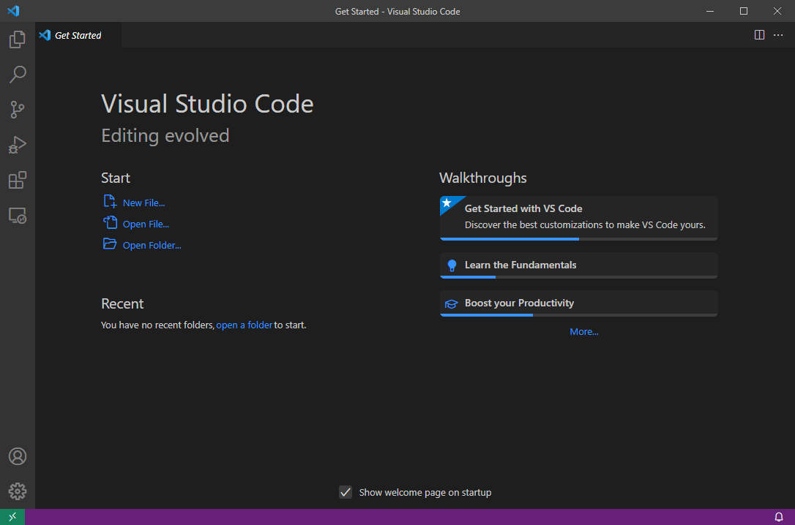
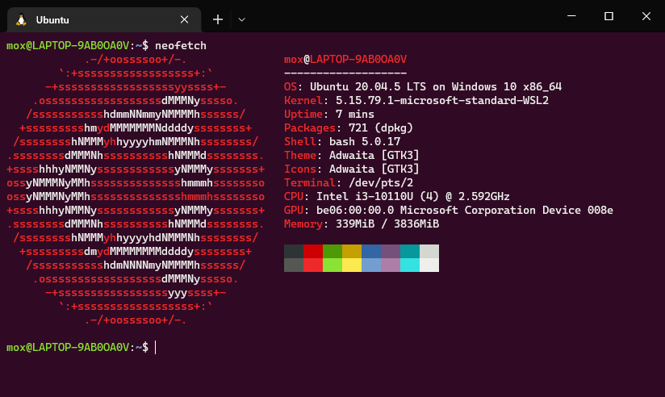
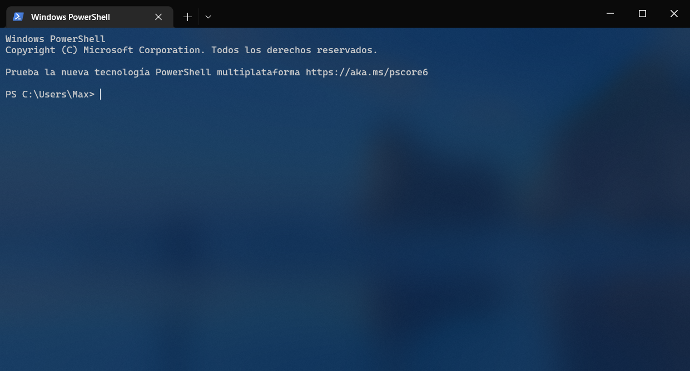
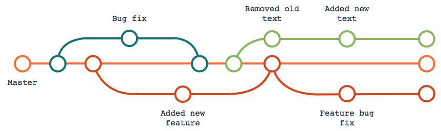
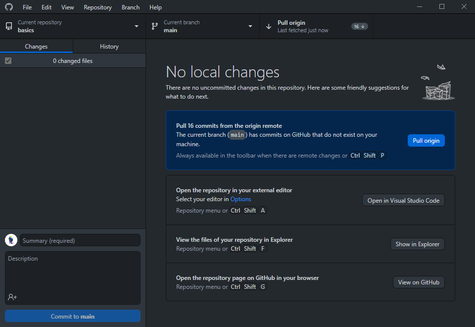

# Useful Software

## Visual Studio Code

<figure><figcaption>
Visual Studio Code window
</figcaption></figure>


Visual Studio Code homepage


**A very simple yet powerful code editor**. Extremely customizable and you can install extensions to extend usage and capabilities. So powerful, you can turn this text editor to an entire IDE[^1] too.


If you want to use other text editor, you can search alternatives in [Alternativeto.net](https://alternativeto.net/software/visual-studio-code/).


## WSL (Windows Subsystem for Linux)

<figure><figcaption>
Ubuntu on WSL in Windows Terminal
</figcaption></figure>


WSL installation documentation


If you are on Windows, the **Windows Subsystem for Linux** will be a must. Is a very powerful tool that let you use a Linux environment inside Windows, seamlessly, almost like running two OS's at the same time.

With this, you get all the power of Linux, with the convenience of not to dual-boot or install virtual machines and things like that.

If you want to install and configure WSL, check the guide below!


[wsl](../software/wsl/)



WSL integrates well with [**Visual Studio Code**](useful-software.md#visual-studio-code) and [**Windows Terminal**](useful-software.md#windows-terminal).


## Windows Terminal

<figure><figcaption>
Windows Terminal window
</figcaption></figure>


Windows Terminal GitHub repository


A very modern, customizable and feature rich command line terminal application.

It has support for tabs, rich text, custom colors, and integrates well with other system's utilities like WSL. Is the successor of CMD[^2], and if you are on Windows, you should use it (on Windows 11 it's already installed).

## Git

<figure><figcaption>
Have you seen this "metro map like" diagrams? It's git.
</figcaption></figure>


Git homepage


You're going to have to use it sooner or later. An SCM[^3] software that helps you to **gain control over the changes you (and your team) make in your project**.

Services like GitHub, GitLab, Bitbucket (and more) relays on this system for all their projects inside.

It will be a tutorial for Git too. Stay tuned!


Git integrates well with [**Visual Studio Code**](useful-software.md#visual-studio-code).


## GitHub Desktop

<figure><figcaption>
GitHub Desktop window
</figcaption></figure>


GitHub Desktop homepage (for Windows and MacOS)


The simplest way to manage your GitHub repository without using too many commands.

This program will help you if you want to have simple control over your changes and pushing it to GitHub.


If you are on Linux, use this fork instead: [shiftkey/desktop](https://github.com/shiftkey/desktop).


[^1]: Integrated Development Environment

    [\[ Wikipedia \]](https://en.wikipedia.org/wiki/Integrated\_development\_environment)

[^2]: Command Prompt

    [\[ Wikipedia \]](https://en.wikipedia.org/wiki/Cmd.exe)

[^3]: Source Code Management

    [\[ Wikipedia \]](https://en.wikipedia.org/wiki/Version\_control)
