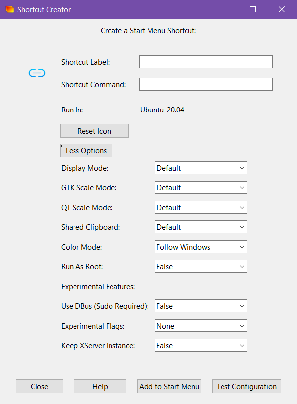

# Useful Software

## Visual Studio Code


Visual Studio Code homepage


**A very simple yet powerful code editor**. You can install extensions to extend use and capabilities. You can turn this text editor to an entire IDE ([Integrated Development Environment](https://en.wikipedia.org/wiki/Integrated\_development\_environment)).

<figure><figcaption>
Visual Studio Code window
</figcaption></figure>


If you want to use other text editor, you can search alternatives in [Alternativeto.net](https://alternativeto.net/software/visual-studio-code/).


## WSL


WSL installation documentation


If you are on Windows, the **Windows Subsystem for Linux** will be a must. Is a very powerful tool that let you use a Linux environment inside Windows, seamlessly, almost like running two OS's at the same time.

<figure><figcaption>
Ubuntu on WSL in Windows Terminal
</figcaption></figure>

With this, you get all the power of Linux, with the convenience of not to dual-boot or install virtual machines and things like that.


WSL integrates well with **Visual Studio Code** and [Windows Terminal](https://github.com/microsoft/terminal).


## Git


Git homepage


You're going to have to use it sooner or later. A SCM software ([Source Code Management](https://en.wikipedia.org/wiki/Version\_control)) that helps you to **gain control over the changes you make (and your team) in your projects**.

Services like GitHub, GitLab, Bitbucket (and more) relays on this system for all their projects inside.

It will be a tutorial for Git too. Stay tuned!


Git integrates well with **Visual Studio Code**.


## GitHub Desktop


GitHub Desktop homepage (for Windows and MacOS)



GitHub Desktop repository fork for Linux


The simplest way to manage your GitHub repository without using too many commands.

<figure><figcaption>
GitHub Desktop window
</figcaption></figure>

This program will help you if you want to have simple control over your changes and pushing it to GitHub.
