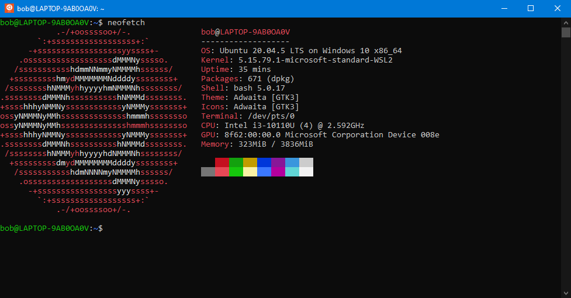

# APT

Unlike Windows, Ubuntu manages their software through **"Packages"**, and it's managed by a **"Package Manager"**. This is convenient for updating every application with ease (like before), and installing new software is easier than ever.

There are many Package Managers, Ubuntu uses APT[^1].

These are the most common usages of APT:

| Function                   | Command                      |
| -------------------------- | ---------------------------- |
| List installed packages    | `sudo apt list`              |
| Install packages           | `sudo apt install <package>` |
| Get updates                | `sudo apt update`            |
| Install updates            | `sudo apt upgrade`           |
| Remove packages            | `sudo apt remove <package>`  |
| Remove all unused packages | `sudo apt autoremove`        |

## Let's install something!

Neofetch is a simple program that shows information about the computer and the operating system.

You can install Neofetch using APT by running this command:

```
sudo apt install neofetch
```

Now you can run Neofetch, simply put `neofetch` in your terminal.

<figure><figcaption><p>Neofetch</p></figcaption></figure>


Search other things to install. Try installing [`gcc`](#user-content-fn-2)[^2]!


&#x20;<mark style="background-color:green;">**Congratulations!**</mark>**  You used APT to install software in Ubuntu.**

[^1]: Advanced Package Tool.

    Default package manager for Ubuntu.

    [\[ Wikipedia \]](https://en.wikipedia.org/wiki/APT\_\(software\))

[^2]: GNU Compiler Collection

    [\[ Wikipedia \]](https://en.wikipedia.org/wiki/GNU\_Compiler\_Collection)
