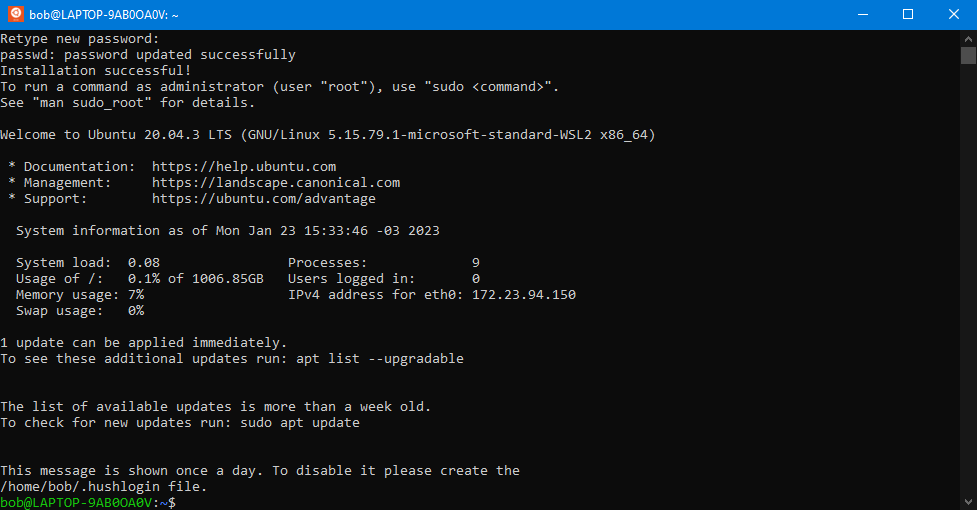

# Configure

The first time you open Ubuntu, you will see this:


```
Installing, this may take a few minutes...

Please create a default UNIX user account.
The username does not need to match your Windows username.
For more information visit: https://aka.ms/wslusers

Enter new UNIX username:_
```


You need to input a username. It can be anything. I will put Bob.


```
Enter new UNIX username: bob

New password:_
```


Now, you need a password. It can be anything too, but **REMEMBER IT**. You will need this to use [`sudo`](#user-content-fn-1)[^1] commands.

When everything is ready, you will see something like this:

<figure><figcaption><p>Terminal window with Ubuntu in WSL</p></figcaption></figure>

&#x20;<mark style="background-color:green;">**👏 Congratulations!**</mark>**  You are now running Ubuntu in WSL.**

[^1]: **Substitute user, do**

    Allows to run programs as other user.


    _The most common usage is to run programs as "root" (or "superuser"), similar to "Run as Administrator" in Windows._


    [\[ Wikipedia \]](https://en.wikipedia.org/wiki/Sudo)
