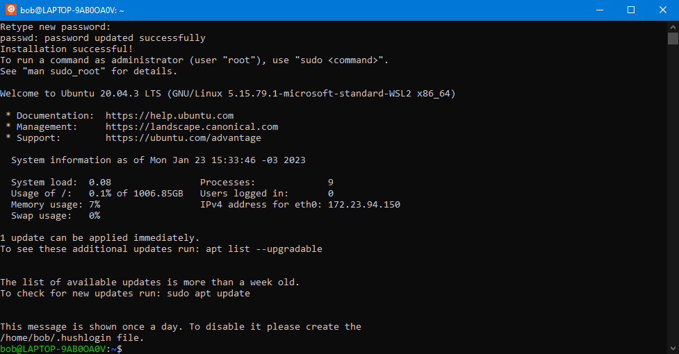

# First steps

<figure><figcaption><p>Terminal window with Ubuntu in WSL</p></figcaption></figure>

Now you are looking at Bash[^1]. Bash is a shell[^2] that can execute commands in the system.

In any Ubuntu based distro, it's good practice to **update packages** after installation. We are going to use APT[^3].

* To get the latest updates for packages, run this command:

```
sudo apt update 
```

* To install the latest updates, run this command after:

```
sudo apt upgrade
```


Every time you use `sudo`, you'll need to enter your password. The same one you set before.


This may take some time. Sit back and relax.

&#x20;<mark style="background-color:green;">**Congratulations!**</mark>**  You just updated your Ubuntu installation.**

[^1]: Bourne Again Shell

    [\[ Wikipedia \]](https://en.wikipedia.org/wiki/Bash\_\(Unix\_shell\))

[^2]: A program that "exposes" the Operating System to a human.

    [\[ Wikipedia \]](https://en.wikipedia.org/wiki/Shell\_\(computing\))

[^3]: Advanced Package Tool.

    Default package manager for Ubuntu.

    [\[ Wikipedia \]](https://en.wikipedia.org/wiki/APT\_\(software\))
