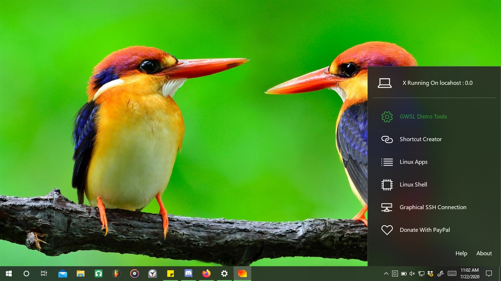
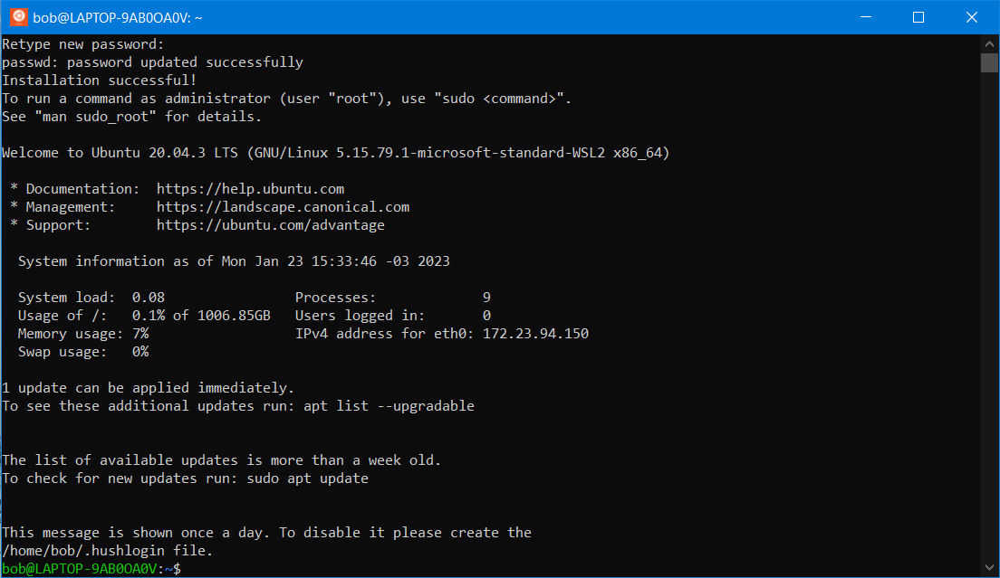

# Graphical Interfaces


**This topic is:  **_<mark style="background-color:red;"><mark style="color:red;background-color:red;">****<mark style="color:red;background-color:red;"></mark>_<mark style="background-color:red;">** **</mark><mark style="background-color:red;">**advanced**</mark>&#x20;


You know WSL can be accessed only by command line. But there's a way to use GUI[^1] apps.

## WSLg (preinstalled)

WSL2 now have its own graphic server called WSLg. It's preinstalled and ready to go.

<figure><figcaption><p>GUI applications from WSL showing in Windows Desktop through WSLg</p></figcaption></figure>


WSLg GitHub repository


You can try it, install some GUI application like `mousepad` in WSL.

```
sudo apt install mousepad
```

You will see Mousepad in your Windows Start Menu.

In my experience, I prefer using an alternative because WSLg gave me some problems, it's beta anyways, errors may happen.

## GWSL

<figure><figcaption><p>GWSL menu in Windows</p></figcaption></figure>


GWSL web page


The same name? Almost! GWSL is an XServer[^2], the same idea as WSLg. In my opinion, with GWSL I feel more "in control" than WSLg. We need to configure it before using.

### Install

You can install GWSL from the [**Microsoft Store**](https://apps.microsoft.com/store/detail/gwsl/9NL6KD1H33V3). Don't worry by the price, that's a donation. If you want it just for free just click "Free Trial", you will have it forever.

When it is installed open GWSL from your Start Menu.


If is the first time you open GWSL in your PC, a firewall prompt may appear. Allow access.


Configure

GWSL is designed to be easy to configure without using any commands.

Open GWSL menu (click the icon in the taskbar) and select **"GWSL Distro Tools"**. Then **"Display/Audio Auto-Exporting"**, **"LibGL Indirect"** and **"Configure DBus"**.

<figure><figcaption><p>Look at the marked options, must be like this.</p></figcaption></figure>

Then, click **"Reboot Ubuntu 20.04"**. That's it.

To check if GWSL was properly configured, check your `.bashrc` file. At the end, it must have these lines:

```bash
export LIBGL_ALWAYS_INDIRECT=1 #GWSL
export DISPLAY=$(cat /etc/resolv.conf | grep nameserver | awk '{print $2; exit;}'):0.0 #GWSL
export PULSE_SERVER=tcp:$(cat /etc/resolv.conf | grep nameserver | awk '{print $2; exit;}') #GWSL
```

[^1]: **Graphical User Interface**

    A form of user interface that let users interact with graphics like images, icons and audio with the software.


    [\[ Wikipedia \]](https://en.wikipedia.org/wiki/Graphical\_user\_interface)

[^2]: **X Window System**


    [\[ Wikipedia \]](https://en.wikipedia.org/wiki/X\_Window\_System)
