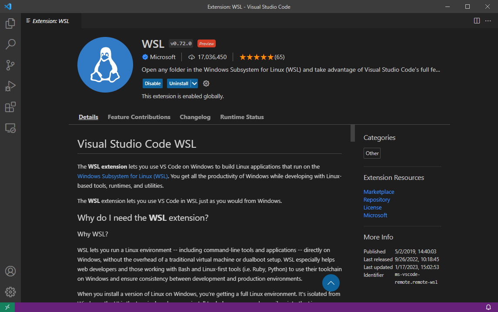
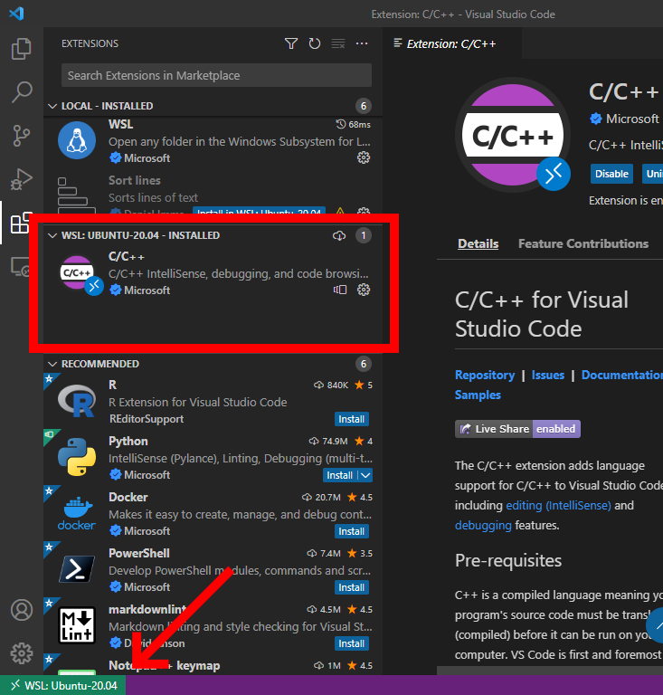
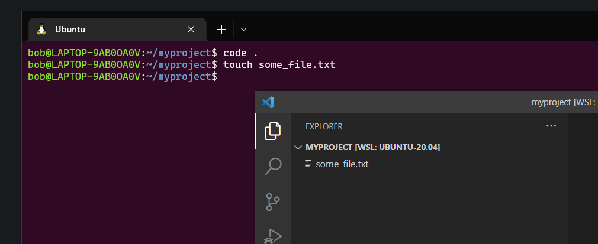

# VSCode Integration

Visual Studio Code has an extension that enables integration with WSL.

Install the WSL extension for Visual Studio Code:

<figure><figcaption><p>WSL extension in Visual Studio Code marketplace</p></figcaption></figure>


WSL Visual Studio Code extension webpage


With this, you can open VSCode in "Linux" mode. That means you can open any folder from Windows and work with it in a Linux environment.

It's like VSCode was runing natively on Linux! Everything you do in this mode is inside WSL (open folders, create files, install extensions, modify settings, etc.)

<figure><figcaption><p>Installing extensions in WSL mode in Visual Studio Code</p></figcaption></figure>

Notice the _**"WSL Ubuntu-20.04 - Installed"**_ and _**"Local - Installed"**_ groups. The extensions installed on WSL will remain in WSL and not in Windows. Extensions installed on Windows are called "local".

You can open a folder from WSL directly in VSCode using the command:

```
code .
```


Don't forget the final dot.


<figure><figcaption><p>Opening a folder from WSL directly into Visual Studio Code</p></figcaption></figure>

&#x20;<mark style="background-color:green;">**👏 Congratulations!**</mark>**  Now you can use Visual Studio Code inside WSL.**


You can stop here if you want.



Now some advanced topics are coming...

