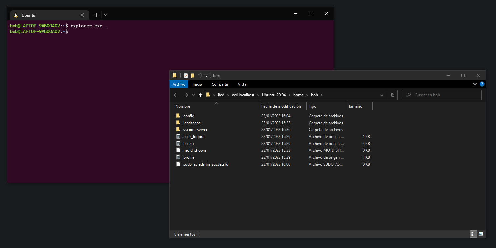
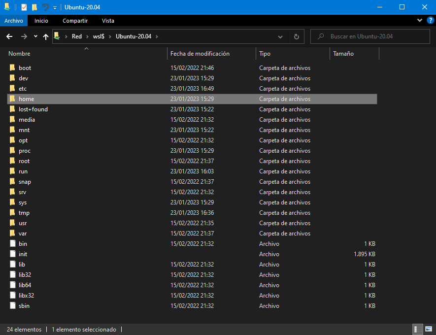
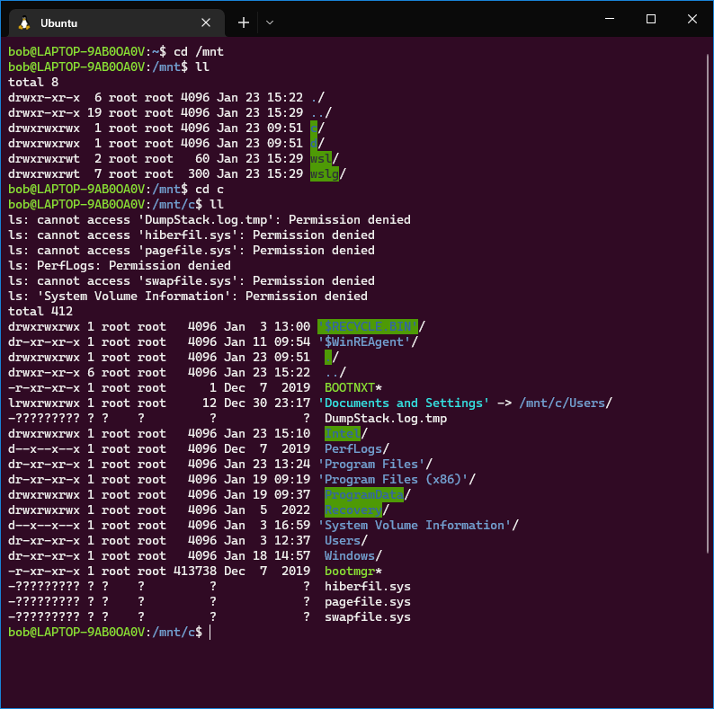

# Windows <--> WSL

Remember at the start when I said:

> It works like a VM but more integrated. That means the system under WSL is NOT isolated from Windows: you can access all files from WSL, and from WSL you can access all files from Windows.

Yes, that's right, you can access all the filesystem of WSL in Windows and viceversa.

## Calling File Explorer from WSL

There's something very neat you can do in WSL: **you can "call" Windows executables (.exe) inside WSL!** Let's try that.

We can call Windows File Explorer (explorer.exe) inside WSL and tell them to open a folder from WSL.

In WSL, run the command **EXACTLY**:

```
explorer.exe .
```


Don't forget the final dot.


This will open File Explorer in the current folder you are in WSL.

<figure><figcaption><p>Calling Windows File Explorer inside WSL</p></figcaption></figure>


Notice the address bar in File Explorer.


## Access WSL files from Windows

You can access WSL files from Windows. The files are located in a virtual "network" WSL creates.

To view WSL available filesystems, enter this address in **File Explorer** or **Run Prompt** (**Win + R**):

```
\\wsl$\
```

<figure><figcaption><p>Accessing Ubuntu filesystem from Windows</p></figcaption></figure>

You will see one folder. That's your Ubuntu filesystem. Go inside and you will see every folder and file of the system.

Search for a **folder called "home"**, there is your personal folder. You can save files there.


**DON'T TOUCH ANYTHING OUTSIDE** `/home/`

You may break things!



**Only access WSL filesystem through this method.**

Accessing with other method may break things.


## Access Windows files from WSL

In Ubuntu, the Windows partitions are located in `/mnt/`.

Inside that folder there's all your mounted Windows partitions (you can indentify them by the initial letter). For example, if you enter folder "c", you are accessing partition `C:\` from Windows.

<figure><figcaption><p>Accessing Windows filesystem from WSL</p></figcaption></figure>


Be careful when using Linux software on Windows filesystem. Unwanted things may happen.


&#x20;<mark style="background-color:green;">**Congratulations!**</mark>**  You can access Ubuntu filesystem from Windows.**
