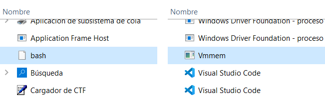
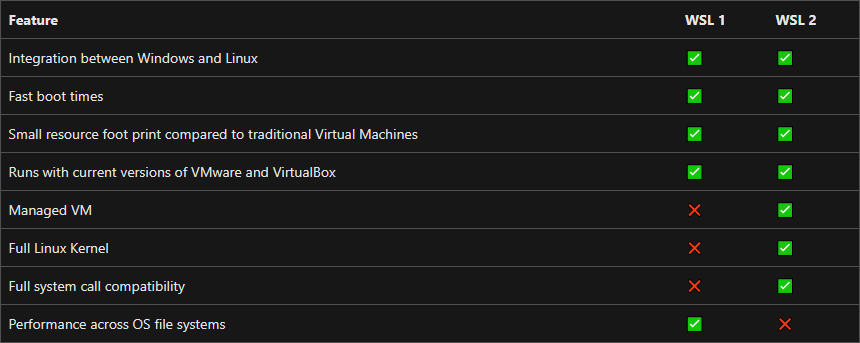

# WSL1 and WSL2


**This topic is:  **_<mark style="background-color:red;"><mark style="color:red;background-color:red;">****<mark style="color:red;background-color:red;"></mark>_<mark style="background-color:red;">** **</mark><mark style="background-color:red;">**advanced**</mark>&#x20;



Microsoft documentation about WSL1 and WSL2


When WSL was introduced, the virtualization technology was different.

WSL1 was more "integrated" in Windows, just like running a trimmed version of the Linux kernel alongside Windows. This improves performance but has its limitations regarding Linux kernel usage.

WSL2 is the new version more "virtualized" than WSL1, it means it runs inside a virtual machine. This allowed to run the entire Linux kernel without problems, keeping the integration with Windows.

<figure><figcaption><p>WSL1 (left) and WSL2 (right) inside Task Manager</p></figcaption></figure>

<figure><figcaption><p>WSL1 and WSL2 comparation chart from Microsoft documentation</p></figcaption></figure>

TL;DR: the new version of WSL2 replicates the "true Linux" kernel, and with that, many internal things work "as it should be", but at the cost of performance.

## Check version

You can check what version of WSL are you using with your distro.

* To view the WSL version of your distros, run this command in **Powershell**:

```
wsl --list --verbose
```

* To view default distro and WSL version for new distros:

```
wsl --status
```

* Set default WSL version for new distros:

```
wsl --set-default-version {1|2}
```

* Set version 2 for specific distribution:

```
wsl --set-version <distro> {1|2}
```


```
wsl --set-version Ubuntu-20.04 2
```



This guide will continue using **WSL 2**.

