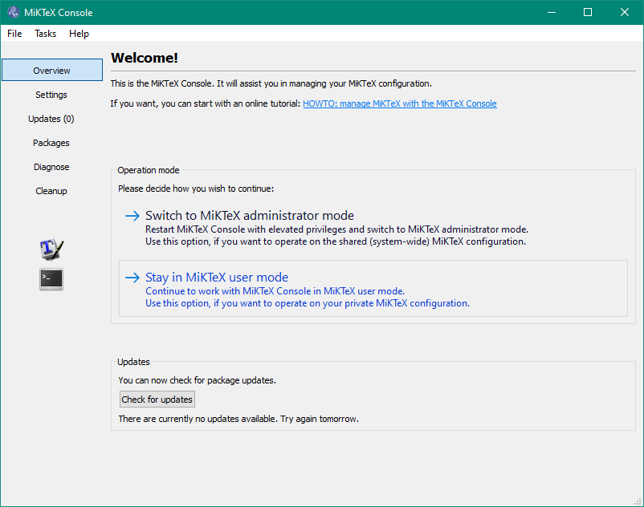
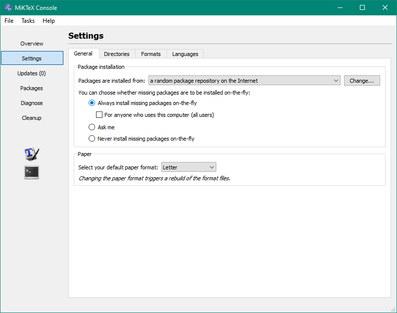
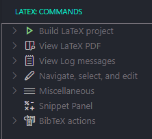

# LaTeX en Windows (VSCode)

## Instalacion

Primero hay que descargar una distribucion LaTeX para Windows, en este caso, MiKTeX:

<https://miktex.org/download>

Para MiKTeX, tambien necesitamos instalar Perl. Es necesario ya que con este lenguaje de scripting se gestionan las *descargas de paquetes en demanda*:

<http://strawberryperl.com/>

Ahora, para VSCode, se necesita la extension que permite tener soporte para el lenguaje LaTeX y muchas mas herramientas:

<https://marketplace.visualstudio.com/items?itemName=James-Yu.latex-workshop>

---

## Configuracion

### MiKTeX

Una vez instalado todo, se puede configurar MiKTeX para activar la descarga de paquetes LaTeX en demanda. Esto quiere decir que MiKTeX va a manejar la instalacion de paquetes *a medida que se vayan necsitando*, el proceso es automatico.

`MiKTeX Console > Stay in user mode`

`Settings > Always install packages on-the-fly`


### VSCode

Ahora, para configurar LaTeX Workshop en VSCode, hay que ir al archivo de configuracion `settings.json` y añadir las siguientes lineas de codigo:

```json
// LaTeX Workshop

  // Carpeta de salida de compilacion (ayuda a organizacion)
  "latex-workshop.latex.outDir": "%DIR%/build",

  // Autolimpieza de compilacion (ayuda a organizacion)
  "latex-workshop.latex.autoClean.run": "onBuilt",

  // Visor PDF incluido en VSCode
  "latex-workshop.view.pdf.viewer": "tab",

  // Fondo del visor de PDF
  "latex-workshop.view.pdf.backgroundColor": "#888888",

  // Mostrar menu de extension en editor
  "latex-workshop.showContextMenu": true,

  // Doble click en PDF para saltar a posicion en codigo
  "latex-workshop.view.pdf.internal.synctex.keybinding": "double-click",
```

---

## Utilizacion

Ahora cuando se escriba un documento LaTeX, aparecera un nuevo menu para acceder a herramientas de la extension LaTeX Workshop, alli apareceran opciones para compilar el documento, y mas utilidades.



---

> *O simplemente usa Overleaf...*
