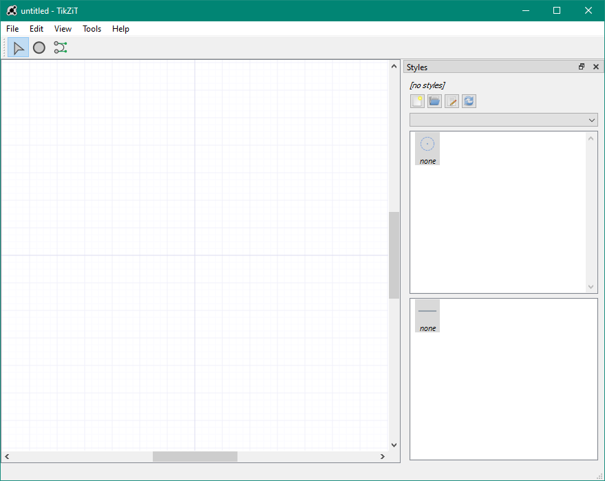

# TikZiT

TikZiT es un programa grafico que ayuda a poder generar dibujos TikZ de forma sencilla, sin tener que hacer código engorroso.

Los archivos se manejan solos, y los estilos son altamente personalizables. Ayuda a tener un código mas limpio, y editar dibujos TikZ mas fácil.

Para poder utilizar TikZiT, debes descargarlo desde su [pagina oficial](https://tikzit.github.io/).

## Preparación

Crea una carpeta de trabajo (o utiliza uno ya hecho) donde se encuentre el documento `.tex` con el que vas a trabajar.

En esa carpeta, necesitas 3 cosas:

- El archivo ``tikzit.sty``: paquete que contiene comandos para poder usar TikZ y TikZiT.

- El archivo ``styles.tikzstyles``: contiene los diseños (colores, líneas, estilos, etc.) para los nodos, enlaces, etc.

- Una carpeta llamada ``figures``: alli se debe guardar los archivos ``.tikz`` generados por el programa TikZiT.

Para usarlos en un documento LaTeX, allí deberás tener lo siguiente en el preámbulo (antes de ``\begin{document}``):

```tex
% Importar el paquete tikzit.sty
\usepackage{tikzit}

% Utilizar el archivo de estilos
\input{styles.tikzstyles}
```

> Véase el documento ``tikzit_example.tex``.

---

## Uso de TikZiT

> Basado en la [guia rapida](https://tikzit.github.io/#quickstart) de la pagina oficial.



En TikZiT, primero deberás cargar el archivo de diseño ``styles.tikzstyles``. Puedes hacerlo con el botón con icono de carpeta en la sección "Styles" de la derecha.

Una vez hecho eso, veras todos los diseños disponibles para los nodos y los enlaces.

Para insertar nodos, toca <kbd>v</kbd> o selecciona el icono de circulo en la parte de arriba, y toca en la cuadricula.

Para insertar enlaces, toca <kbd>e</kbd> o selecciona el icono de enlace en la parte de arriba, toca un nodo, y arrastra hacia otro nodo.

Para seleccionar, toca <kbd>s</kbd> o selecciona el icono de puntero, puedes arrastrar nodos, si tocas dos veces un nodo, puedes agregar texto dentro de el; si tocas un enlace, puedes cambiar su curvatura.

## Insertar dibujos

Primero, guarda tu dibujo hecho en TikZiT con <kbd>Ctrl</kbd>+<kbd>s</kbd> y ponle un nombre, digamos por ejemplo ``figura1.tikz``, **y guardarlo en la carpeta ``figures`` que creaste antes**.

Una vez hecho eso, en el documento `.tex` donde vas a insertar el dibujo, puedes escribir:

```tex
\begin{document}
  %...

  Un dibujo TikZ:
  \tikzfig{figura1}

  Un dibujo TikZ como ecuacion:
  \begin{equation}
    \tikzfig{figura1}
  \end{equation}

  Un dibujo TikZ centrado:
  \ctikzfig{figura1}

  %...
\end{document}
```

Notese los comandos `\tikzfig` y `\ctikzfig`:

- `\tikzfig` inserta de forma simple un dibujo TikZ.
- `\ctikzfig` funciona igual que el primero, pero este lo pone centrado.

**Ambos comandos buscan dibujos TikZ por nombre en la carpeta `figures` si es que existe. Si no existe dicha carpeta, los dibujos se buscaran en la misma carpeta donde se encuentre el archivo ``.tex``.**
